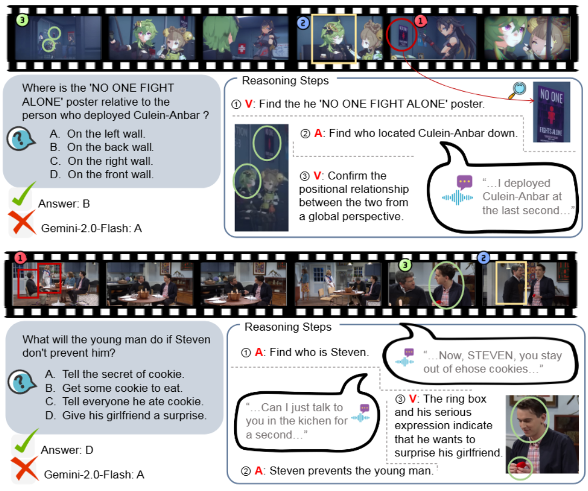
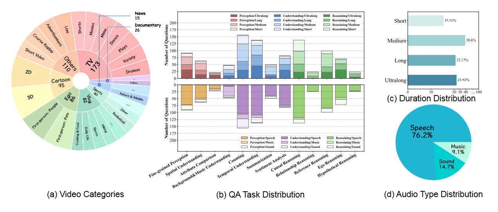
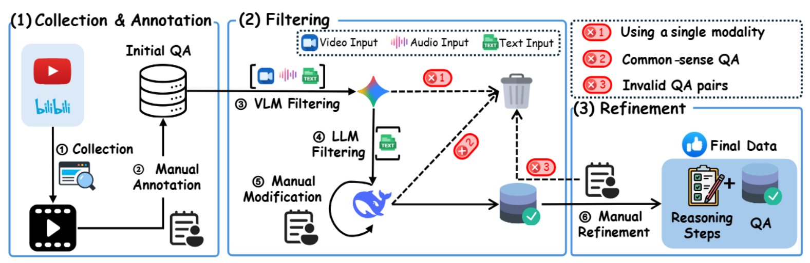
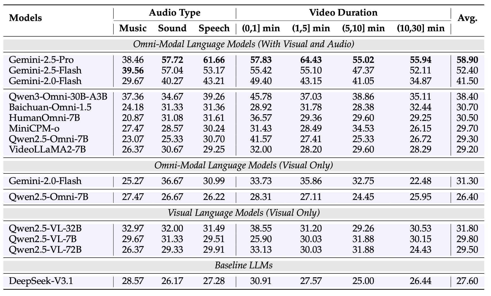
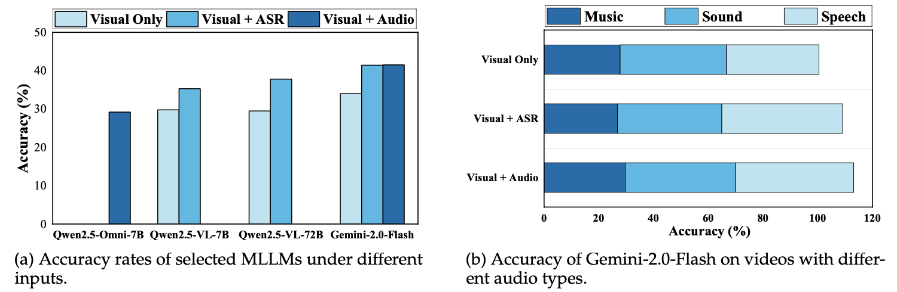
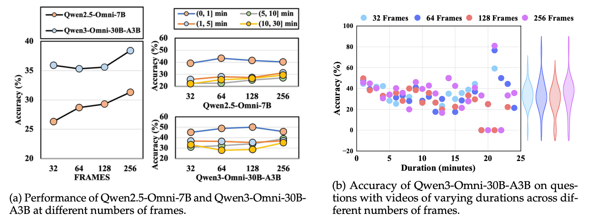

<p align="center">
  
</p>

<h1 align="center">OmniVideoBench: Towards Audio-Visual Understanding

 Evaluation for Omni MLLMs</h1>
<p align="center">
  <a href="https://omnivideobench.github.io/omnivideobench_home/">
    
  </a>
  <a href="https://huggingface.co/datasets/NJU-LINK/OmniVideoBench">
    
  </a>
  <a href="https://arxiv.org/abs/2510.10689">
    
  </a >
</p>

---

## ✨ Overview

Recent advances in **multimodal large language models (MLLMs)** have brought remarkable progress in video understanding.  
However, most existing benchmarks fail to **jointly evaluate** both *audio* and *visual* reasoning — often focusing on one modality or overlooking their interaction.

🎬 **OmniVideoBench** fills this gap.  
It’s a **large-scale, rigorously curated** benchmark for assessing **synergistic audio-visual intelligence**, emphasizing **modality complementarity**, **logical consistency**, and **long-term temporal reasoning**.

- **1,000** high-quality QA pairs  
- **628** diverse videos (seconds → 30 minutes)  
- Each annotated with **step-by-step multimodal reasoning**  
- Evaluations reveal a large **gap between models and human reasoning**

<p align="center">
  
  <br>
  <em>Figure 1. OmniVideoBench overview — “V” indicates visual reasoning and “A” indicates audio reasoning. Each example includes atomic reasoning traces.</em>
</p>

---


## 🎧 Diverse Reasoning Dimensions

OmniVideoBench tests **deep audio-visual reasoning** across a wide variety of tasks and modalities:

- **628 videos** from 8 major categories & 68 subcategories  
- **1,000 QA pairs** with detailed reasoning chains  
- **13 reasoning types**, from perception to causal inference  
- **Audio–Visual Complementarity** ensured for every question  
- **Long-Video Evaluation:** durations up to 30 minutes  

<p align="center">
  
  <br>
  <em>Figure 2. OmniVideoBench covers broad categories and reasoning types. Distributions show video durations and three audio types (Speech, Sound, Music).</em>
</p>

---

## 🧩 Pipeline

A glance at how OmniVideoBench was built — from raw videos to verified reasoning annotations 👇

1. 🎥 **Video Collection:** Gather long-form videos from diverse domains and acoustic environments.  
2. ✂️ **Clip Segmentation:** Divide videos into context-preserving segments.  
3. 💭 **Question Generation:** Design multimodal questions that require both audio and visual reasoning.  
4. 🔎 **Reasoning Decomposition:** Break down each QA into atomic reasoning steps (audio / visual / both).  
5. 🧾 **Annotation & Verification:** Human experts verify correctness, modality alignment, and logical flow.  
6. 🚦 **Quality Filtering:** Remove ambiguous or low-quality samples through multi-stage review.  
7. 📦 **Formatting & Packaging:** Structure QA data in standardized JSON and create benchmark splits.

<p align="center">
  
  <br>
  <em>Figure 3. Data construction and refinement pipeline of OmniVideoBench.</em>
</p>

---

## 🌟 License

Our dataset is under the CC-BY-NC-SA-4.0 license.

⚠️ If you need to access and use our dataset, you must understand and agree: This dataset is for research purposes only and cannot be used for any commercial or other purposes. The user assumes all effects arising from any other use and dissemination.

We do not own the copyright of any raw video files. Currently, we provide video access to researchers under the condition of acknowledging the above license. For the video data used, we respect and acknowledge any copyrights of the video authors. 

If the original authors of the related works still believe that the videos should be removed, please contact caoruili507@gmail.com or directly raise an issue.

---

## 🚀 Quick Start & Usage Examples

### 📥 Dataset Access

To access the OmniVideoBench dataset and videos, please:

1. **Download the dataset**: Please read our license requirements or complete the <a href="https://huggingface.co/datasets/NJU-LINK/OmniVideoBench"> questionnaire </a>. If you agree, please send an email to our lead author to request access: [Contact Us](mailto:caoruili507@gmail.com?cc=yu.chen.8525@gmail.com,jiyiiiyyy@gmail.com,liujiaheng@nju.edu.cn&subject=Request%20Access%20to%20OmniVideoBench&body=please%20fill%20in%20your%20real%20information~)
2. **Place videos**: Download videos and place them in `./videos/` directory
3. **Load QA pairs**: The benchmark question-answer pairs are provided in `data.json`

#### Data Structure

The dataset follows a structured JSON format. Each entry contains video metadata and multiple QA pairs:

```json
[
  {
    "video": "video_10",
    "video_type": "Cartoon",
    "duration": "04:23",
    "questions": [
      {
        "question": "When the man and woman in the picture were discussing ice cubes, why did they notice Superman behind them?",
        "question_type": "causal reasoning",
        "audio_type": "Sound",
        "reasoning_steps": [
          {
            "modality": "vision",
            "evidence": "they notice Superman at 0:37.",
            "inference": "get the Superman."
          },
          {
            "modality": "vision",
            "evidence": "Superman just turned around and took a step.",
            "inference": "get the point."
          },
          {
            "modality": "audio",
            "evidence": "Superman made a sound when he stepped on the wooden floor.",
            "inference": "Because Superman made a sound when he stepped on the wooden floor."
          }
        ],
        "answer": "Because Superman made a sound when he stepped on the wooden floor.",
        "options": [
          "A.Because Superman slammed the door with a loud noise.",
          "B.Because Superman made a sound when he stepped on the wooden floor.",
          "C.Because Superman's robe fell off.",
          "D.Because Superman made too much noise while eating."
        ],
        "correct_option": "B"
      }
    ]
  }
]
```


### 🔧 Evaluation

#### For Open-Source Models
Create conda environment from `./envs` and run evaluation scripts:
```bash
conda env create -f ./envs/environment_qwenomni.yml
conda activate qwenomni
python eval/qwenomni_eval.py \
    --model_path /path/to/model \
    --input_file data.json \
    --video_dir ./videos
```

#### For Closed-Source Models
Use API-based evaluation. Example with Gemini:
```bash
# Single-threaded evaluation (default)
python -m eval.gemini_eval \
    --api_key YOUR_API_KEY \
    --models gemini-2.0-flash \
    --input_file data.json \
    --video_dir ./videos

# Multi-threaded evaluation (faster)
python -m eval.gemini_eval \
    --api_key YOUR_API_KEY \
    --models gemini-2.0-flash gemini-2.5-flash \
    --multithread \
    -w 15 \
    --input_file data.json \
    --video_dir ./videos

# Vision-only mode (without audio)
python -m eval.gemini_eval \
    --api_key YOUR_API_KEY \
    --models gemini-2.5-pro \
    --no_sound \
    --input_file data.json \
    --video_dir ./videos
```

##### 🔑 Key Parameters

- `--api_key`: Your API key (required for closed-source models)
- `--models`: Model(s) to evaluate, space-separated (default: all Gemini models)
- `--input_file`: Path to QA JSON file (default: `data.json`)
- `--video_dir`: Video files directory (default: `./videos`)
- `--multithread`: Enable multi-threaded mode (default: single-threaded)
- `-w, --max_workers`: Number of concurrent threads (default: 15, only for multithread mode)
- `--no_sound`: Vision-only evaluation without audio


## 📝 Evaluation Results 

<p align="center">
  <a href="https://omnivideobench.github.io/omnivideobench_home/#leaderboard">
    
  </a>
</p>

OmniVideoBench highlights a clear **performance gap** between **closed-source** and **open-source** omni-models —  
showing that genuine audio-visual reasoning remains a **major unsolved challenge**.

<p align="center">
  
  <br>
  <em>Figure 4. Comparison across Gemini, Qwen, Baichuan, MiniCPM, and VideoLLaMA models on OmniVideoBench.</em>
</p>

<details>
<summary>📦 More results can been seen here.</summary>

<p align="center">
  
  <br>
  <em>Figure 5. Performance Comparison of some Open-Source and Closed-Source Omni Models on 13 Tasks in OmniVideoBench. Here, “Attr”: Attribute Comparison, “Bac&Mu”: Background and Music Un- derstanding, “Caus”: Cause and Effect Reasoning, “Coun”: Counting, “Ego”: Ego Reasoning, “Fine”: Fine-grained Perception, “Hypo”: Hypothetical Reasoning, “Ref”: Referential Reasoning, “Rela”: Rela- tionship Reasoning, “Senti”: Sentiment Analysis, “Spati”: Spatial Reasoning, “Summ”: Summarization,
“Tempo”: Temporal Sequencing Understanding.
 </em>
</p>

<p align="center">
  
  <br>
  
</p>

<p align="center">
  
  <br>
  
</p>

</details>


---

## 🪶 Citation

If you find **OmniVideoBench** useful for your research, please cite:

```bibtex
@misc{li2025omnivideobenchaudiovisualunderstandingevaluation,
      title={OmniVideoBench: Towards Audio-Visual Understanding Evaluation for Omni MLLMs}, 
      author={Caorui Li and Yu Chen and Yiyan Ji and Jin Xu and Zhenyu Cui and Shihao Li and Yuanxing Zhang and Jiafu Tang and Zhenghao Song and Dingling Zhang and Ying He and Haoxiang Liu and Yuxuan Wang and Qiufeng Wang and Zhenhe Wu and Jiehui Luo and Zhiyu Pan and Weihao Xie and Chenchen Zhang and Zhaohui Wang and Jiayi Tian and Yanghai Wang and Zhe Cao and Minxin Dai and Ke Wang and Runzhe Wen and Yinghao Ma and Yaning Pan and Sungkyun Chang and Termeh Taheri and Haiwen Xia and Christos Plachouras and Emmanouil Benetos and Yizhi Li and Ge Zhang and Jian Yang and Tianhao Peng and Zili Wang and Minghao Liu and Junran Peng and Zhaoxiang Zhang and Jiaheng Liu},
      year={2025},
      eprint={2510.10689},
      archivePrefix={arXiv},
      primaryClass={cs.AI},
      url={https://arxiv.org/abs/2510.10689}, 
}
```
