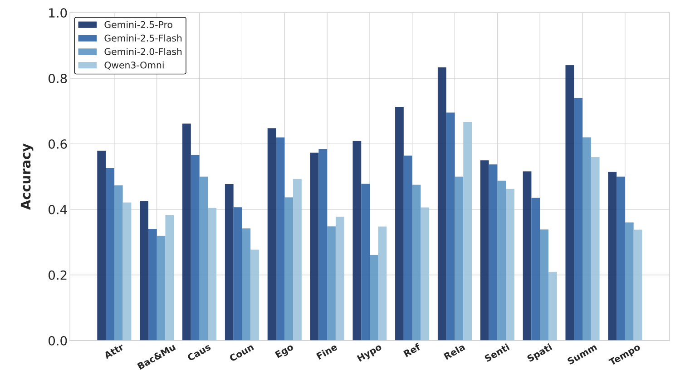

<p align="center">
  
</p>

<h1 align="center">OmniVideoBench: Towards Audio-Visual Understanding

 Evaluation for Omni MLLMs</h1>
<p align="center">
  <a href="https://njulink.github.io/OmniVideoBench/">
    
  </a>
  <a href="https://huggingface.co/datasets/NJU-LINK/OmniVideoBench">
    
  </a>
  <!-- <a href="https://arxiv.org/abs/2510.12345">
    
  </a> -->
</p>

---

## ✨ Overview

Recent advances in **multimodal large language models (MLLMs)** have brought remarkable progress in video understanding.  
However, most existing benchmarks fail to **jointly evaluate** both *audio* and *visual* reasoning — often focusing on one modality or overlooking their interaction.

🎬 **OmniVideoBench** fills this gap.  
It’s a **large-scale, rigorously curated** benchmark for assessing **synergistic audio-visual intelligence**, emphasizing **modality complementarity**, **logical consistency**, and **long-term temporal reasoning**.

- **1,000** high-quality QA pairs  
- **628** diverse videos (seconds → 30 minutes)  
- Each annotated with **step-by-step multimodal reasoning**  
- Evaluations reveal a large **gap between models and human reasoning**

<p align="center">
  
  <br>
  <em>Figure 1. OmniVideoBench overview — “V” indicates visual reasoning and “A” indicates audio reasoning. Each example includes atomic reasoning traces.</em>
</p>

---


## 🎧 Diverse Reasoning Dimensions

OmniVideoBench tests **deep audio-visual reasoning** across a wide variety of tasks and modalities:

- **628 videos** from 8 major categories & 68 subcategories  
- **1,000 QA pairs** with detailed reasoning chains  
- **13 reasoning types**, from perception to causal inference  
- **Audio–Visual Complementarity** ensured for every question  
- **Long-Video Evaluation:** durations up to 30 minutes  

<p align="center">
  
  <br>
  <em>Figure 2. OmniVideoBench covers broad categories and reasoning types. Distributions show video durations and three audio types (Speech, Sound, Music).</em>
</p>

---

## 🧩 Pipeline

A glance at how OmniVideoBench was built — from raw videos to verified reasoning annotations 👇

1. 🎥 **Video Collection:** Gather long-form videos from diverse domains and acoustic environments.  
2. ✂️ **Clip Segmentation:** Divide videos into context-preserving segments.  
3. 💭 **Question Generation:** Design multimodal questions that require both audio and visual reasoning.  
4. 🔎 **Reasoning Decomposition:** Break down each QA into atomic reasoning steps (audio / visual / both).  
5. 🧾 **Annotation & Verification:** Human experts verify correctness, modality alignment, and logical flow.  
6. 🚦 **Quality Filtering:** Remove ambiguous or low-quality samples through multi-stage review.  
7. 📦 **Formatting & Packaging:** Structure QA data in standardized JSON and create benchmark splits.

<p align="center">
  
  <br>
  <em>Figure 3. Data construction and refinement pipeline of OmniVideoBench.</em>
</p>

---

## 🌟 LinLicense

Our dataset is under the CC-BY-NC-SA-4.0 license.

⚠️ If you need to access and use our dataset, you must understand and agree: This dataset is for research purposes only and cannot be used for any commercial or other purposes. The user assumes all effects arising from any other use and dissemination.

We do not own the copyright of any raw video files. Currently, we provide video access to researchers under the condition of acknowledging the above license. For the video data used, we respect and acknowledge any copyrights of the video authors. 

If the original authors of the related works still believe that the videos should be removed, please contact caoruili507@gmail.com or directly raise an issue.

---


## 📊 Evaluation Results

OmniVideoBench highlights a clear **performance gap** between **closed-source** and **open-source** omni-models —  
showing that genuine audio-visual reasoning remains a **major unsolved challenge**.

<p align="center">
  
  <br>
  <em>Figure 4. Comparison across Gemini, Qwen, Baichuan, MiniCPM, and VideoLLaMA models on OmniVideoBench.</em>
</p>

<details>
<summary>📦 More results can been seen here.</summary>

<p align="center">
  
  <br>
  <em>Figure 5. Performance Comparison of some Open-Source and Closed-Source Omni Models on 13 Tasks in OmniVideoBench. Here, “Attr”: Attribute Comparison, “Bac&Mu”: Background and Music Un- derstanding, “Caus”: Cause and Effect Reasoning, “Coun”: Counting, “Ego”: Ego Reasoning, “Fine”: Fine-grained Perception, “Hypo”: Hypothetical Reasoning, “Ref”: Referential Reasoning, “Rela”: Rela- tionship Reasoning, “Senti”: Sentiment Analysis, “Spati”: Spatial Reasoning, “Summ”: Summarization,
“Tempo”: Temporal Sequencing Understanding.
 </em>
</p>

<p align="center">
  
  <br>
  
</p>

<p align="center">
  
  <br>
  
</p>

</details>


---

## 🪶 Citation

If you find **OmniVideoBench** useful for your research, please cite:

```bibtex
@article{OmniVideoBench2025,
  title={OmniVideoBench: Towards Audio-Visual Understanding Evaluation for Omni MLLMs}
}
